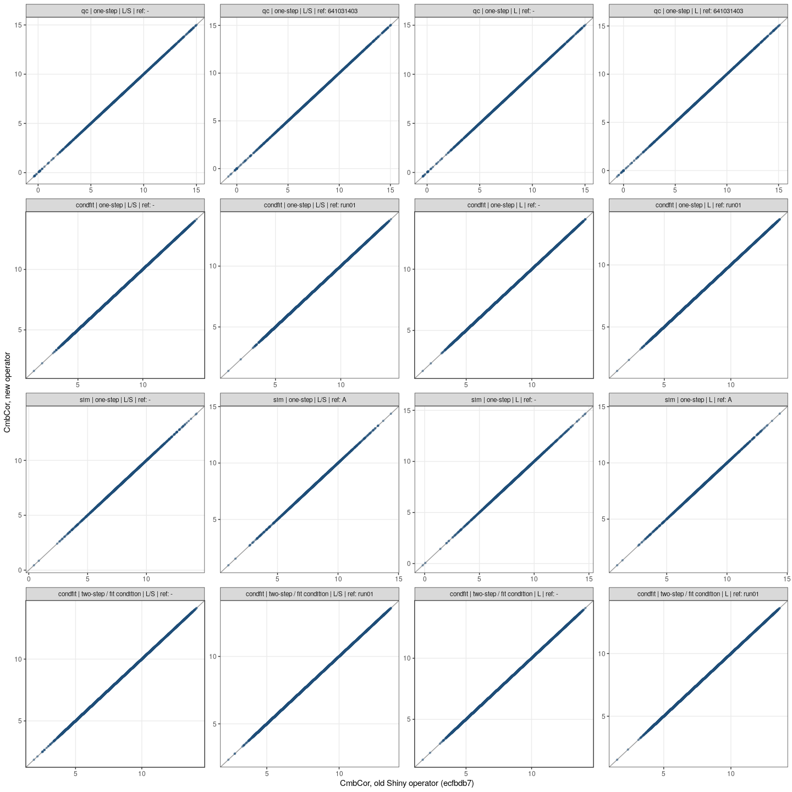

# Phase A — the new operator reproduces the old Shiny operator

**Question.** Before any bug is fixed: does the new non-Shiny `combat_operator` give the same corrected values (`CmbCor`) as the old `dascombat_shiny_fit_operator` (commit `ecfbdb7`) on the example data?

**Answer.** Yes. In all 16 compared cases the largest absolute difference between old and new `CmbCor` is **0** (threshold for "equal": ≤ 1e-10). See [`comparison.csv`](comparison.csv) and [`old_vs_new_scatter.png`](old_vs_new_scatter.png).

Terms (batch, fit condition, L / L/S, …) are defined in [`CONTEXT.md`](../../../CONTEXT.md).

## How the comparison was done

- **Old operator**, replicated offline (no Shiny UI): the ComBat code is the unchanged `R/pgcombat.R` of commit `ecfbdb7` ([`dev/reference/pgcombat_shiny_ecfbdb7.R`](../../../dev/reference/pgcombat_shiny_ecfbdb7.R)); the data path follows the old `server.R` ([`dev/reference/server_shiny_ecfbdb7.R`](../../../dev/reference/server_shiny_ecfbdb7.R)): `reshape2::acast` to a peptide × sample matrix, the first colour factor as batch.
  - Old **one-step** = fit on all samples and return the correction computed inside `fit()` (what "Done" returned).
  - Old **two-step** = step 1: fit on a view that contains only the fit-condition samples ("Return link to Combat model"); step 2: `apply()` that model to all samples ("Apply saved model").
- **New operator**: the unmodified `main.R` run against a mock Tercen context ([`dev/mock_ctx.R`](../../../dev/mock_ctx.R)). In phase A its `R/pgcombat.R` is identical to the old one. The new operator has no two-step mode; the old two-step is compared with the new one-step **fit condition** (`UseFitCondition`, `FitConditionFactors = Grouping`, `FitConditionValues = REF`).
- Comparison per peptide × sample cell; reported is the maximum absolute difference per case.

Reproduce (from the repo root, Docker image built from this commit):

```bash
docker build -t combat_operator:dev .
docker run --rm -v "$PWD:/src" --entrypoint Rscript combat_operator:dev /src/dev/compare_old_new.R docs/reports/phaseA_equivalence
docker run --rm -v "$PWD:/src" --entrypoint Rscript combat_operator:dev /src/dev/probe_d2_convergence.R docs/reports/phaseA_equivalence
```

## Data

| Data set | Content | Crosstab used |
|---|---|---|
| `qc` — [`example_data_QC.csv`](../../../dev/data/example_data_QC.csv) (real) | 178 peptides × 12 samples; 3 barcodes × 4 conditions (Control, T1–T3), 1 sample per condition per barcode | rows `ID`; columns `Barcode`, `Row`, `Supergroup`, `Test Condition`; colour (batch) `Barcode`; y `logTransformed` |
| `condfit` — [`example_data_conditionfit_ref.csv`](../../../dev/data/example_data_conditionfit_ref.csv) (real, `Sample.name` recoded to 2-letter codes) | 126 peptides × 283 samples (sample = Barcode + Array); 6 runs; `Grouping` DAS / REF with 12–20 REF samples per run; each sample is a technical replicate of one of 52 patients | rows `ID`; columns `Barcode`, `Array`, `Grouping`, `Sample.name`; colour (batch) `Run`; y `identity` (VSN) |
| `sim` — [`simulated.csv`](../../../dev/data/simulated.csv) ([`dev/simulate_data.R`](../../../dev/simulate_data.R), seed 1) | 150 peptides × 24 samples; 3 batches × 8; per-peptide batch shift (A 0, B +1×, C −1×), batch C spread ×2 | rows `peptide`; columns `sample`, `condition`; colour (batch) `batch`; y `value` |

## Cases and results

| Data | Mode | Model | Reference batch | Max abs diff new vs old | Max abs diff new vs old with `/` restored |
|---|---|---|---|---|---|
| qc | one-step | L/S | – | 0 | 1.314 |
| qc | one-step | L/S | 641031403 | 0 | 3.141 |
| qc | one-step | L | – | 0 | 0 |
| qc | one-step | L | 641031403 | 0 | 0 |
| condfit | one-step | L/S | – | 0 | 0.989 |
| condfit | one-step | L/S | run01 | 0 | 2.029 |
| condfit | one-step | L | – | 0 | 0 |
| condfit | one-step | L | run01 | 0 | 0 |
| sim | one-step | L/S | – | 0 | 2.135 |
| sim | one-step | L/S | A | 0 | 4.119 |
| sim | one-step | L | – | 0 | 0 |
| sim | one-step | L | A | 0 | 0 |
| condfit | old two-step vs new fit condition (REF) | L/S | – | 0 | 0 |
| condfit | old two-step vs new fit condition (REF) | L/S | run01 | 0 | 0 |
| condfit | old two-step vs new fit condition (REF) | L | – | 0 | 0 |
| condfit | old two-step vs new fit condition (REF) | L | run01 | 0 | 0 |

The two-step / fit-condition comparison is done on `condfit` only: in `qc` the only usable condition (Control) has one sample per batch, which is too few to fit a model (see D3).



The last column previews defect D1: restoring the missing `/` changes one-step L/S results by up to 0.99–4.1, and changes nothing for L models and for the two-step / fit-condition cases (these use `apply()`, which was never affected).

## Defects deliberately kept in phase A (to be fixed in phase B)

| # | Defect in the old code | Effect | Status |
|---|---|---|---|
| D1 | Commit `86a7fbe` ("fix reference batch+") removed the trailing `/` in the adjustment line of `fit()`; the division by the batch scale (δ*) became a separate, discarded statement. `apply()` still divides. | One-step L/S corrects only the batch mean (behaves like L); old one-step and two-step disagree on the same data | confirmed (last column above) |
| D2 | Stop rule of the empirical-Bayes iteration `it.sol`: `change = max(abs(g.new − g.old) / g.old, …)` — no `abs()` on the denominator; inherited unchanged from `sva::ComBat` | see below | probed, effect on results to be measured in phase B |
| D3 | No check for too few fit samples with the L model: one sample per batch → pooled variance 0 → `NaN` output without error | `NaN` CmbCor | confirmed (fit on Control in `qc`) |
| D4 | `apply()` does not check the batches of the data against the batches of the model | unknown batch → cryptic "replacement has length zero" error | from code |
| D5 | The `par.prior = FALSE` (non-parametric) branch calls `int.eprior()`, which does not exist | dead code; would fail if used | from code |

### D2 in detail

ComBat estimates, per batch and peptide, a shift γ and a scale δ, and shrinks them towards the batch-wide average (empirical Bayes). The shrunken values are found iteratively in `it.sol`; the loop stops when the largest *relative* change of γ and δ drops below 1e-4. The relative change is computed as `(new − old) / old`:

- **Negative γ**: the ratio becomes negative and is never the maximum, so peptides with a negative shift are ignored by the stop rule. The loop can stop while their values still change.
- **γ exactly 0**: division by zero → `Inf` (or `NaN` for 0/0).

This happens with a reference batch: the data are standardised with the reference batch's own mean, so the reference batch's estimated shift is 0 for every peptide (exactly or to floating-point precision).

Probe ([`dev/probe_d2_convergence.R`](../../../dev/probe_d2_convergence.R), L/S model, all data sets, first batch as reference; full table in [`d2_convergence.csv`](d2_convergence.csv)):

- **Reference batch**: minimum |γ| = 0 (`qc`, `sim`) or 1e-16 (`condfit`, i.e. 0 up to rounding), first stop-rule value `Inf` or 230 respectively; the loop stops after 2 iterations. Harmless: `fit()` afterwards overwrites the reference batch with "no correction" (γ* = 0, δ* = 1). No crash on any data set — D2 is **not** the cause of the old "reference batch" problem.
- **Other batches**: 14–142 of 178 (`qc`), 57–68 of 126 (`condfit`), 59–87 of 150 (`sim`) peptides have a negative γ and are ignored by the stop rule; 3–10 iterations.

Whether the early stop changes the corrected values noticeably is measured in phase B; the behaviour is identical in `sva::ComBat`.

## Differences to the old operator that do not affect the compared results

R/pgcombat.R in the new operator is byte-for-byte identical to the old Shiny operator's R/pgcombat.R at commit `ecfbdb7`. It is the same `pgCombat` R6 class, with the same `fit()`, `apply()` and iteration code (`it.sol`) and the same bugs D1–D5. What changed is only the code around the ComBat function, in `main.R` and `R/functions.R`.

- All colour factors form the batch (old: first colour factor only, defect D7). With one colour factor, as in all compared cases, this is identical.
- Settings are checked before fitting, with plain-language messages (unknown factor, reference batch not found, too few fit samples per batch — this check also prevents the `NaN` of D3). These only trigger where the old code failed or returned `NaN`.
- No two-step mode; replaced by the fit condition (compared above).

## Files in this folder

| File | Content |
|---|---|
| `report.md` | this report |
| `comparison.csv` | one row per case: max abs diff vs old, vs old with `/` restored, `equal_to_old` |
| `old_vs_new_scatter.png` | new vs old CmbCor for every cell, one panel per case |
| `d2_convergence.csv` | per data set × reference setting × batch: iterations, stop-rule value after iteration 1, min \|γ\|, number of negative γ |
