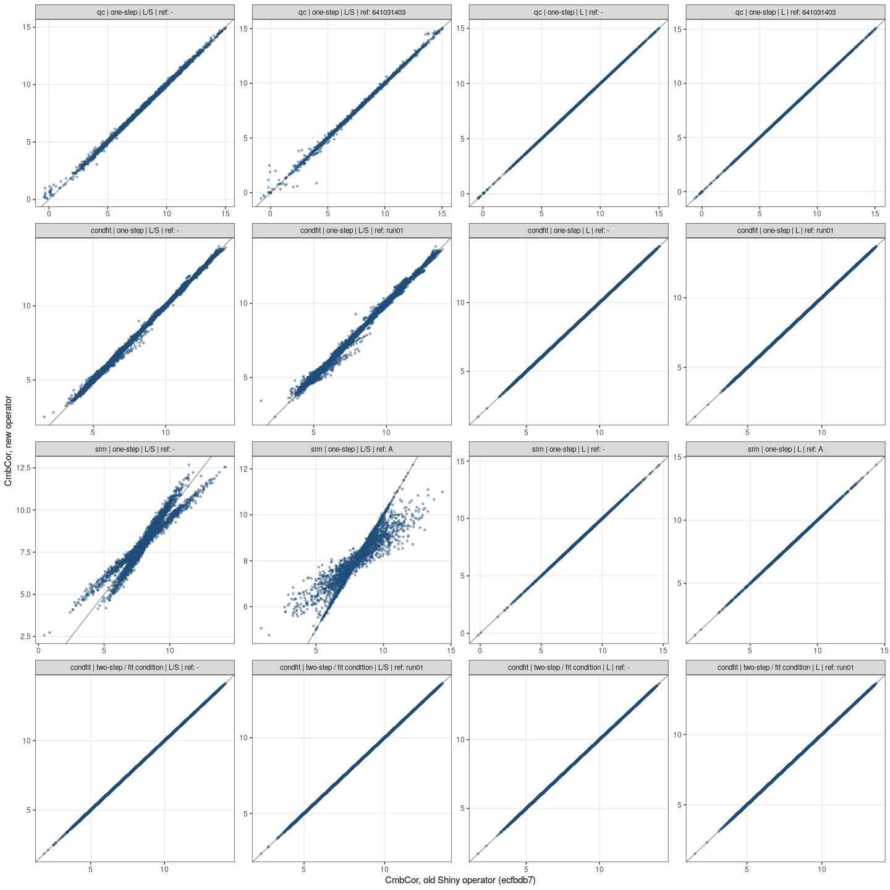

# Phase B — defects of the old ComBat code fixed

**Question.** After fixing the defects found in phase A ([phase A report](../phaseA_equivalence/report.md)): does the operator now behave as ComBat should, and where do its results differ from the old Shiny operator?

**Answer.**
- One-step **L/S** results change: the scale (spread) correction is applied again (defect D1). They equal the old code with only the missing `/` restored (max abs diff ≤ 4.4e-16).
- **L** results and all **fit-condition** results (the old two-step use) are unchanged (max abs diff ≤ 4.4e-16).
- `fit()` and `apply()` now agree in every case, reference batches stay unchanged, and the results equal `sva::ComBat` (see [Tests](#tests-of-the-combat-code)).

Terms (batch, fit condition, L / L/S, …) are defined in [`CONTEXT.md`](../../../CONTEXT.md). Data sets and comparison method are the same as in phase A.

## What changed

| # | Defect (see phase A report) | Phase B |
|---|---|---|
| D1 | missing `/` in `fit()`: scale correction skipped in one-step L/S | **fixed**: `/` restored |
| D2 | stop rule of `it.sol` ignores peptides with negative γ; divides by 0 for the reference batch | **kept** (identical to `sva::ComBat`); effect measured below: ≤ 3.7e-5 |
| D3 | 1 fit sample per batch with the L model → silent `NaN` | **fixed** in phase A already by the sample-count check before fitting (plain-language error) |
| D4 | `apply()` does not check batches against the model | **fixed**: stops naming the unknown batches and the batches of the model |
| D5 | non-parametric branch calls a missing function | **fixed**: branch removed; `par.prior = FALSE` stops with a message |

Other changes in this phase:
- `main.R` always fits on the fit samples (all samples, or the fit condition) and corrects all samples with `apply()` (in phase A, one-step returned the correction computed inside `fit()`, as the old operator did; after the D1 fix both are identical).
- The PCA PNG shows the settings under the figures, e.g. `Parameters: Model type: L/S | Reference batch: run01 | Fit condition: Grouping - REF`; several fit conditions are joined with "or".

## Comparison with the old Shiny operator

From [`comparison.csv`](comparison.csv) ([`dev/compare_old_new.R`](../../../dev/compare_old_new.R)):

| Data | Mode | Model | Reference batch | Max abs diff new vs old | new vs old with `/` restored |
|---|---|---|---|---|---|
| qc | one-step | L/S | – | 1.314 | 0 |
| qc | one-step | L/S | 641031403 | 3.141 | 4.4e-16 |
| qc | one-step | L | – | 0 | 0 |
| qc | one-step | L | 641031403 | 4.4e-16 | 4.4e-16 |
| condfit | one-step | L/S | – | 0.989 | 0 |
| condfit | one-step | L/S | run01 | 2.029 | 0 |
| condfit | one-step | L | – | 0 | 0 |
| condfit | one-step | L | run01 | 0 | 0 |
| sim | one-step | L/S | – | 2.135 | 0 |
| sim | one-step | L/S | A | 4.119 | 0 |
| sim | one-step | L | – | 0 | 0 |
| sim | one-step | L | A | 0 | 0 |
| condfit | old two-step vs new fit condition (REF) | L/S | – | 0 | 0 |
| condfit | old two-step vs new fit condition (REF) | L/S | run01 | 0 | 0 |
| condfit | old two-step vs new fit condition (REF) | L | – | 0 | 0 |
| condfit | old two-step vs new fit condition (REF) | L | run01 | 0 | 0 |



### What the D1 fix does to the batch spread

Per batch, the SD of each peptide across the batch's samples, averaged over peptides — the spread ComBat's scale parameter acts on ([`spread_per_batch.csv`](spread_per_batch.csv), [`dev/spread_per_batch.R`](../../../dev/spread_per_batch.R); one-step L/S, no reference batch):

| Data | Batch | Raw | Old L/S | New L/S |
|---|---|---|---|---|
| qc | 641031403 | 0.615 | 0.615 | 0.470 |
| qc | 641031404 | 0.580 | 0.580 | 0.466 |
| qc | 641031406 | 0.344 | 0.344 | 0.436 |
| condfit | re-run25 | 0.217 | 0.217 | 0.228 |
| condfit | run01 | 0.202 | 0.202 | 0.231 |
| condfit | run02 | 0.207 | 0.207 | 0.231 |
| condfit | run03 | 0.285 | 0.285 | 0.231 |
| condfit | run04rep | 0.214 | 0.214 | 0.230 |
| condfit | run24 | 0.243 | 0.243 | 0.229 |
| sim | A | 1.017 | 1.017 | 1.326 |
| sim | B | 1.045 | 1.045 | 1.317 |
| sim | C (spread ×2 by design) | 2.017 | 2.017 | 1.384 |

The old one-step L/S correction left the within-batch spread exactly as in the raw data — it only shifted the batches, i.e. it behaved like an L model. The fixed correction brings all batches to a common spread.

## Tests of the ComBat code

[`dev/test_pgcombat.R`](../../../dev/test_pgcombat.R), all data sets × L/S, L × no reference / first batch as reference ([`test_pgcombat.csv`](test_pgcombat.csv)):

| Check | Result |
|---|---|
| `fit_vs_apply`: correcting the fitted samples with `apply()` equals the correction inside `fit()` | max abs diff ≤ 4.4e-16 in all 12 cases (before the D1 fix: up to 4.1 for L/S) |
| `ref_unchanged`: reference-batch samples are returned unchanged | yes, all 6 cases with a reference batch |
| `no_nan` | no `NaN`/`NA` in any case |
| `vs_sva`: max abs diff to `sva::ComBat` 3.54.0 (`par.prior = TRUE`, same `mean.only` and `ref.batch`) | ≤ 1.8e-15 in all 12 cases |
| `apply()` with a batch the model was not fitted on | stops: "The data contain batches the model was not fitted on: C. Batches in the model: A, B" |

The fixed implementation therefore reproduces the reference implementation of ComBat (Johnson, Li & Rabinovic 2007, as implemented in Bioconductor `sva`), including its reference-batch variant. `sva` is a test-only dependency (installed into the git-ignored `dev/.rlib`, see `CLAUDE.md`), not part of the operator image.

## D2: effect of the stop rule on the results

[`dev/probe_d2_effect.R`](../../../dev/probe_d2_effect.R) fits each case twice: with the current stop rule (relative change < 1e-4, negative γ ignored), and with a strict one (relative change of the absolute values < 1e-10, at most 10 000 iterations). Largest absolute difference of the corrected values ([`d2_effect.csv`](d2_effect.csv)):

| Data | Reference batch | Max abs diff CmbCor | Value range of the data |
|---|---|---|---|
| qc | – | 1.5e-05 | 15.1 |
| qc | 641031403 | 3.7e-05 | 15.1 |
| condfit | – | 3.0e-07 | 12.7 |
| condfit | re-run25 | 1.9e-06 | 12.7 |
| sim | – | 3.4e-05 | 19.6 |
| sim | A | 9.2e-06 | 19.6 |

At most 3.7e-5 on data spanning 13–20 units (about 2 parts per million of the range) — far below the measurement precision. The stop rule is therefore kept as it is, identical to `sva::ComBat`, so that results stay exactly comparable with the reference implementation.

## Tercen unit test

The expected output of the unit test (`tests/`) was regenerated, because both the L/S values and the PCA image changed: two runs in Tercen Studio from commit `a00b5aa` were byte-identical and equal to `main.R` on the mock context (max abs diff 5e-14); the real install gate passes (`default_params_LS successful`, commit `dfaca0a`).

Reproduce (repo root, image built from this commit):

```bash
docker run --rm -v "$PWD:/src" --entrypoint Rscript combat_operator:dev /src/dev/compare_old_new.R docs/reports/phaseB_bugfix
docker run --rm -v "$PWD:/src" --entrypoint Rscript combat_operator:dev /src/dev/test_pgcombat.R docs/reports/phaseB_bugfix
docker run --rm -v "$PWD:/src" --entrypoint Rscript combat_operator:dev /src/dev/probe_d2_effect.R docs/reports/phaseB_bugfix
docker run --rm -v "$PWD:/src" --entrypoint Rscript combat_operator:dev /src/dev/spread_per_batch.R docs/reports/phaseB_bugfix
```

## Files in this folder

| File | Content |
|---|---|
| `report.md` | this report |
| `comparison.csv` | one row per case: max abs diff vs old, vs old with `/` restored |
| `old_vs_new_scatter.png` | new vs old CmbCor for every cell, one panel per case |
| `spread_per_batch.csv` | within-batch spread per batch: raw, old L/S, new L/S |
| `test_pgcombat.csv` | ComBat code tests per data set × model × reference, incl. difference to `sva::ComBat` |
| `d2_effect.csv` | D2: difference between the current and a strict stop rule |
